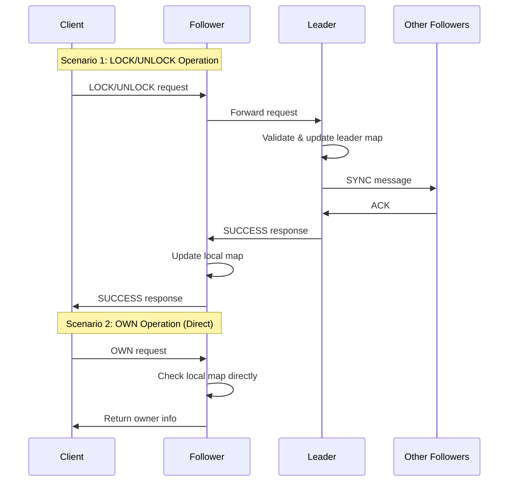

# 🔒 Distributed Lock System with Consensus

A distributed consensus system implementing a distributed lock mechanism with one leader server and multiple follower servers, ensuring data consistency through replication.

## 📋 Table of Contents

- [Overview](#overview)
- [Architecture](#architecture)
- [Features](#features)
- [Installation](#installation)
- [Configuration](#configuration)
- [Usage](#usage)
- [Testing](#testing)
- [Technical Architecture](#technical-architecture)
- [Communication Protocol](#communication-protocol)
- [Troubleshooting](#troubleshooting)

## 🎯 Overview

This project implements a distributed consensus system that allows multiple clients to manage distributed locks in a consistent manner. The system ensures that only one client can own a lock at a time, even in a distributed environment.

### Key Features

- ✅ **Leader-Follower Architecture** with automatic replication
- ✅ **Strong consistency** of data across all servers
- ✅ **Robust synchronization protocol** with ACK and timeouts
- ✅ **Advanced error handling** with detailed logging
- ✅ **Real-time monitoring** of server status
- ✅ **Socket communication** for network connectivity

## 🏗️ Architecture

```
┌─────────────────┐    ┌─────────────────┐    ┌─────────────────┐
│   VM Leader     │    │  VM Follower 1  │    │  VM Follower 2  │
│  10.0.2.3:5000  │    │  10.0.2.4:5000  │    │  10.0.2.5:5000  │
└─────────────────┘    └─────────────────┘    └─────────────────┘
         │                       │                       │
         │                       │                       │
         └───────────────────────┼───────────────────────┘
                                 │
                    ┌─────────────────┐
                    │     Clients     │
                    │  (Multiple)     │
                    └─────────────────┘
```

### Components

- **Leader Server**: Manages all lock operations and synchronizes with followers
- **Follower Servers**: Replicate the leader's map and can respond to read requests
- **Clients**: Connect to any server to perform operations

## 🚀 Features

### Supported Operations

| Operation | Description | Server |
|-----------|-------------|---------|
| `LOCK` | Acquire a distributed lock | Leader only |
| `UNLOCK` | Release a distributed lock | Leader only |
| `OWN` | Check the owner of a lock | All servers |

### Operating Rules

- **LOCK**: Success if lock doesn't exist, failure otherwise
- **UNLOCK**: Success if client owns the lock, failure otherwise
- **OWN**: Returns the owner client ID or "NONE"

## 📦 Installation

### Prerequisites

- Java 8 or higher
- 3 Ubuntu virtual machines (or physical machines)
- Network connectivity between machines

### Installation Steps

1. **Clone the project**
   ```bash
   git clone (https://github.com/alexandrabaron/Distributed-Lock-System.git)
   cd distributed-lock-project
   ```

2. **Compile Java files**
   ```bash
   javac Server.java
   javac Client.java
   javac DistributedLockTest.java
   ```

3. **Configure firewall** (on each VM)
   ```bash
   sudo ufw allow 5000
   ```

## ⚙️ Configuration

### Network Configuration

The system is configured to work with the following IP addresses:

| Server | IP Address | Port | Role |
|---------|------------|------|------|
| Leader | 10.0.2.3 | 5000 | Primary server |
| Follower 1 | 10.0.2.4 | 5000 | Replicated server |
| Follower 2 | 10.0.2.5 | 5000 | Replicated server |

### Configuration Modification

To change IP addresses, modify the `Server.java` file:

```java
private static final Map<String, Integer> SERVER_PORTS = new HashMap<>();
static {
    SERVER_PORTS.put("10.0.2.3", 5000);   // Leader VM
    SERVER_PORTS.put("10.0.2.4", 5000);   // Follower VM 1
    SERVER_PORTS.put("10.0.2.5", 5000);   // Follower VM 2
}
```

## 🎮 Usage

### Starting Servers

**⚠️ Important: Start in the following order**

1. **Start the Leader** (VM 10.0.2.3)
   ```bash
   java Server 10.0.2.3 5000 leader
   ```

2. **Wait 5 seconds, then start Follower 1** (VM 10.0.2.4)
   ```bash
   java Server 10.0.2.4 5000 follower
   ```

3. **Wait 5 seconds, then start Follower 2** (VM 10.0.2.5)
   ```bash
   java Server 10.0.2.5 5000 follower
   ```

### Using Clients

**Simple test:**
```bash
java Client <server_ip> <port> <client_id>
```

**Examples:**
```bash
# Connect to leader
java Client 10.0.2.3 5000 Client1

# Connect to a follower
java Client 10.0.2.4 5000 Client2
```

## 🧪 Testing

### Automated Test

```bash
java DistributedLockTest
```

This test performs:
- Concurrent lock acquisition
- Consistency verification
- Lock release tests
- Concurrent access simulation

### Manual Test

```bash
# Sequential test
java Client 10.0.2.3 5000 Client1

# Concurrent test (in another terminal)
java Client 10.0.2.4 5000 Client2
```

### Expected Results

```
=== Testing Lock Sequence for lock1 ===
Client Client1 - Owner of lock1: NONE
Client Client1 - TryLock(lock1) Response: SUCCESS
Client Client1 - Owner of lock1: Client1
Client Client1 - TryLock(lock1) Response: FAIL
Client Client1 - TryUnlock(lock1) Response: SUCCESS
Client Client1 - Owner of lock1: NONE
=== End of Test Sequence ===
```

## 🔧 Technical Architecture

### Data Flow



### Thread Management

- **Thread Pool**: Uses `ExecutorService` to manage connections
- **Thread Safety**: Synchronization with `synchronized` on critical operations
- **Timeout**: Timeout handling to prevent deadlocks

## 📡 Communication Protocol

### Client-Server Messages

| Message | Format | Description |
|---------|--------|-------------|
| LOCK | `LOCK,<lockName>,<clientId>` | Acquisition request |
| UNLOCK | `UNLOCK,<lockName>,<clientId>` | Release request |
| OWN | `OWN,<lockName>,<clientId>` | Owner request |

### Inter-Server Messages

| Message | Format | Description |
|---------|--------|-------------|
| SYNC | `SYNC,<command>,<lockName>,<clientId>` | Synchronization |
| REGISTER | `REGISTER,<serverIp>:<port>` | Follower registration |
| ACK | `ACK` | Acknowledgment |

### Responses

| Response | Description |
|---------|-------------|
| `SUCCESS` | Operation successful |
| `FAIL` | Operation failed |
| `NONE` | No owner |
| `ERROR` | System error |
| `TIMEOUT` | Network timeout |

## 🚨 Troubleshooting

### Common Issues

| Error | Cause | Solution |
|--------|-------|----------|
| `Connection refused` | Server not started | Check that servers are running |
| `Port already in use` | Port occupied | `sudo lsof -i :5000` then `sudo kill -9 <PID>` |
| `Timeout` | Network issue | Check connectivity between VMs |
| `Registration failed` | Leader not started | Start leader before followers |

### Diagnostic Commands

```bash
# Check used ports
sudo lsof -i :5000

# Test connectivity
ping 10.0.2.3
telnet 10.0.2.3 5000

# Check logs
tail -f server.log
```

### Logs and Monitoring

The system displays detailed logs with:
- 🔗 Incoming connections
- 📨 Messages received/sent
- 🔄 Synchronization operations
- ⚠️ Errors and timeouts
- 📊 Server status

## 📊 Performance

### Metrics

- **Latency**: ~10-50ms for local operations
- **Throughput**: ~100-500 operations/second
- **Consistency**: 100% (strong consistency guaranteed)

### Optimizations

- **Thread Pool**: Efficient connection management
- **Timeout**: Prevents deadlocks
- **Asynchronous logs**: No performance impact

## 🔒 Security

### Considerations

- **Authentication**: Not implemented (can be added)
- **Encryption**: Clear communication (TLS possible)
- **Authorization**: Basic access control by client ID

### Recommendations

- Use TLS for communication
- Implement client authentication
- Add audit logs

## 👥 Authors

- **Alexandra Baron**
- **Maria Stivala**
- **Mathis Liens**
- **Arnaud**
- **Charles**
- **Baptiste Halçaren**

---

**🎉 Thank you for using our distributed lock system!**


