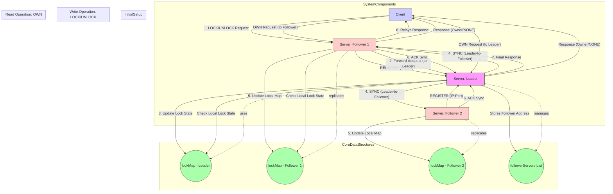

```mermaid
graph TD
    %% System components (Servers and Client)
    subgraph SystemComponents
        A[Client]
        B[Server: Leader]
        C[Server: Follower 1]
        D[Server: Follower 2]
    end

    %% Core Data Structures (The locks and server lists)
    subgraph CoreDataStructures
        E((lockMap - Leader))
        F((lockMap - Follower 1))
        G((lockMap - Follower 2))
        H((followerServers List))
    end
    
    %% Initial Setup Flow
    subgraph InitialSetup
        C -- REGISTER (IP:Port) --> B
        D -- REGISTER (IP:Port) --> B
        B -- Stores Follower Address --> H
    end

    %% Write Operation Flow (LOCK/UNLOCK)
    subgraph WriteOperation[Write Operation: LOCK/UNLOCK]
        direction LR
        
        A -- 1. LOCK/UNLOCK Request --> C
        C -- 2. Forward Request (to Leader) --> B
        B -- 3. Update Lock State --> E
        
        %% Synchronization Step
        B -- 4. SYNC (Leader-to-Follower) --> C
        B -- 4. SYNC (Leader-to-Follower) --> D
        
        C -- 5. Update Local Map --> F
        D -- 5. Update Local Map --> G
        
        C -- 6. ACK Sync --> B
        D -- 6. ACK Sync --> B
        
        B -- 7. Final Response --> C
        C -- 8. Relays Response --> A
    end

    %% Read Operation Flow (OWN)
    subgraph ReadOperation[Read Operation: OWN]
        direction LR
        
        A -- OWN Request (to Leader) --> B
        B -- Check Local Lock State --> E
        B -- Response (Owner/NONE) --> A
        
        A -- OWN Request (to Follower) --> C
        C -- Check Local Lock State --> F
        C -- Response (Owner/NONE) --> A
    end

    %% Data Links
    B -. uses .-> E
    B -. manages .-> H
    C -. replicates .-> F
    D -. replicates .-> G

    %% Styles for clarity
    classDef leader fill:#f9f,stroke:#333,stroke-width:2px;
    class B leader
    classDef follower fill:#fcc,stroke:#333;
    class C,D follower
    classDef client fill:#ccf,stroke:#333;
    class A client
    classDef data fill:#afa,stroke:#333;
    class E,F,G,H data
```